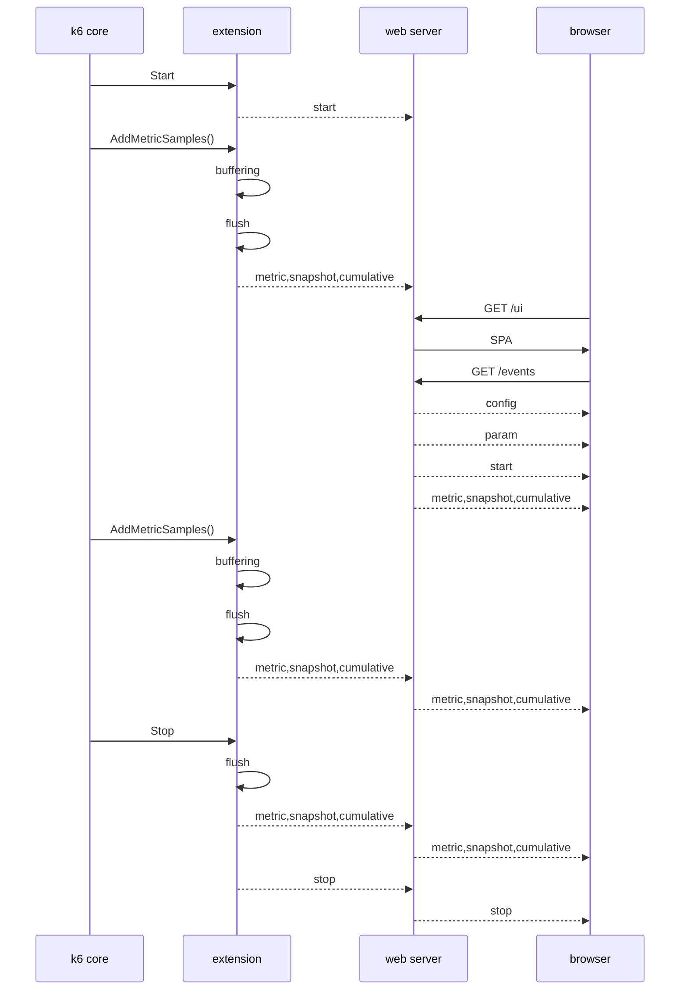

<!--
SPDX-FileCopyrightText: 2023 Raintank, Inc. dba Grafana Labs

SPDX-License-Identifier: AGPL-3.0-only
-->

[](https://goreportcard.com/report/github.com/grafana/xk6-dashboard)
[](https://github.com/grafana/xk6-dashboard/actions?query=workflow%3ATest+branch%3Amaster)
[](https://codecov.io/gh/szkiba/xk6-dashboard)
[](https://api.reuse.software/info/github.com/grafana/xk6-dashboard)


# xk6-dashboard <!-- omit in toc -->

A [k6 extension](https://k6.io/docs/extensions/) that enables creating a web based metrics dashboard for [k6](https://k6.io).

By using the **xk6-dashboard** output extension you can access metrics from [k6](https://k6.io) process via [server-sent events (SSE)](https://developer.mozilla.org/en-US/docs/Web/API/Server-sent_events/Using_server-sent_events). All custom [k6](https://k6.io) metrics ([Counter](https://k6.io/docs/javascript-api/k6-metrics/counter/), [Gauge](https://k6.io/docs/javascript-api/k6-metrics/gauge/), [Rate](https://k6.io/docs/javascript-api/k6-metrics/rate/), [Trend](https://k6.io/docs/javascript-api/k6-metrics/trend/)) and [built-in metrics](https://k6.io/docs/using-k6/metrics/#built-in-metrics) are accessible in the event stream.

The test run report can be exported to a responsive self-contained HTML file, which can be displayed even without an Internet connection.

>[!Warning]
> You are currently looking at the documentation of the next version on the master branch, which does not correspond in all respects to the operation of the last release. Select the tag corresponding to the release for more precise documentation.
>
> Major differences:
> - The output name has changed, in previous versions it was `dashboard`, from the next version it will be `web-dashboard`. The documentation already reflects this.
> - Screenshots may differ.

**Screenshots**

*Overview*

The overview tab provides an overview of the most important metrics of the test run. Graphs plot the value of metrics over time.


*Timings*

The timings tab provides an overview of test run HTTP timing metrics. Graphs plot the value of metrics over time.


*Summary Tab*

The summary tab contains a summary of the test run metrics. The tables contain the aggregated values of the metrics for the entire test run.


**HTML Report**

The report can be saved in a single responsive HTML file.

*Single file HTML report*


See [sample HTML report](screenshot/k6-dashboard-html-report.html) or try the [online version](https://raw.githack.com/grafana/xk6-dashboard/master/screenshot/k6-dashboard-html-report.html)

**Table of Contents**

- [Download](#download)
- [Build](#build)
- [Usage](#usage)
- [Exit](#exit)
- [Parameters](#parameters)
- [Environment](#environment)
- [Docker](#docker)
- [Save report](#save-report)
- [Events](#events)
- [Command Line](#command-line)
  - [Docker](#docker-1)

## Download

You can download pre-built k6 binaries from the [Releases](https://github.com/grafana/xk6-dashboard/releases/) page. Check the [Packages](https://github.com/grafana/xk6-dashboard/pkgs/container/xk6-dashboard) page for pre-built k6 Docker images.

## Build

To build a `k6` binary with this extension, first ensure you have the prerequisites:

- [Go toolchain](https://go101.org/article/go-toolchain.html)
- Git

Then:

1. Download `xk6`:
  ```bash
  $ go install go.k6.io/xk6/cmd/xk6@latest
  ```

2. Build the binary:
  ```bash
  $ xk6 build --with github.com/grafana/xk6-dashboard@latest
  ```

## Usage

Without parameters the dashboard will be accessible on port `5665` with any web browser: http://127.0.0.1:5665

```plain
$ ./k6 run --out web-dashboard script.js

          /\      |‾‾| /‾‾/   /‾‾/   
     /\  /  \     |  |/  /   /  /    
    /  \/    \    |     (   /   ‾‾\  
   /          \   |  |\  \ |  (‾)  | 
  / __________ \  |__| \__\ \_____/ .io

  execution: local
     script: script.js
     output: web-dashboard http://127.0.0.1:5665
```

> Using `--out web-dashboard=open` will automatically open a new browser window.

## Exit

The k6 process waits to exit as long as there is at least one open browser window for the dashboard extension. In this way, the report can be downloaded, for example, even after the test has been completed.

In certain environments, it is not allowed that the k6 process does not exit after the test run (eg CI/CD pipeline). In this case, it is advisable to disable the HTTP port (with the `-1` value of  `port` parameter).

## Parameters

The output extension accepts parameters in a standard query string format:

```
k6 run --out 'web-dashboard=param1=value1&param2=value2&param3=value3'
```

> Note the apostrophes (`'`) around the `--out` parameter! You should use it to escape `&` characters from the shell (or use backslash before `&`).

The following parameters are recognized:

parameter | description
----------|------------
host      | Hostname or IP address for HTTP endpoint (default: "", empty, listen on all interfaces)
port      | TCP port for HTTP endpoint (default: `5665`; `0` = random, `-1` = no HTTP), example: `8080`
period    | Event emitting frequency (default: `10s`), example: `1m`
open      | Set to `true` (or empty) to open the browser window automatically
export    | File name to save the report (default: "", empty, the report will not be saved)
record    | File name to save the dashboard events (default: "", empty, the events will not be saved)
tag       | Precomputed metric tag name(s) (default: "group"), can be specified more than once

*The `export` parameter used to be `report`, for compatibility reasons the name `report` can still be used.*

## Environment

The dashboard parameters can also be specified in environment variables. The name of the environment variable belonging to the given parameter is created by converting the parameter name to uppercase and adding the `K6_WEB_DASHBOARD_` prefix.

environment variable | description
----------|------------
K6_WEB_DASHBOARD_HOST      | Hostname or IP address for HTTP endpoint (default: "", empty, listen on all interfaces)
K6_WEB_DASHBOARD_PORT      | TCP port for HTTP endpoint (default: `5665`; `0` = random, `-1` = no HTTP), example: `8080`
K6_WEB_DASHBOARD_PERIOD    | Event emitting frequency (default: `10s`), example: `1m`
K6_WEB_DASHBOARD_OPEN      | Set to `true` (or empty) to open the browser window automatically
K6_WEB_DASHBOARD_EXPORT    | File name to save the report (default: "", empty, the report will not be saved)
K6_WEB_DASHBOARD_RECORD    | File name to save the dashboard events (default: "", empty, the events will not be saved)
K6_WEB_DASHBOARD_TAG       | Precomputed metric tag name(s) (default: "group"), can be specified more than once


## Docker

You can also use pre-built k6 image within a Docker container. In order to do that you will need to execute something like the following:

**Linux**

```plain
docker run -v $(pwd):/scripts -p 5665:5665 -it --rm ghcr.io/grafana/xk6-dashboard:latest run --out=dashboard /scripts/script.js
```

**Windows**

```plain
docker run -v %cd%:/scripts -p 5665:5665 -it --rm ghcr.io/grafana/xk6-dashboard:latest run --out=dashboard /scripts/script.js
```

The dashboard will accessible on port `5665` with any web browser: http://127.0.0.1:5665

## Save report

The test run report can be exported to a responsive self-contained HTML file. For export, the file name must be specified in the `export` parameter. If the file name ends with `.gz`, the HTML report will automatically be gzip compressed.

```plain
k6 run --out web-dashboard=export=test-report.html script.js
```

The exported HTML report file does not contain external dependencies, so it can be displayed even without an Internet connection. Graphs can be zoomed by selecting a time interval. If necessary, the report can be printed or converted to PDF format.

By using the `--export` switch of the `web-dashboard replay` command, the report can also be generated afterwards from the previously saved JSON format result (`--out json=test-result.json`).

The report can also be viewed and downloaded from the dashboard UI using the buttons on the "Report" tab.

```plain
k6 web-dashboard replay --export test-report.html test-result.json
```

*Example HTML report*


See [sample HTML report](screenshot/k6-dashboard-html-report.html) or try the [online version](https://raw.githack.com/grafana/xk6-dashboard/master/screenshot/k6-dashboard-html-report.html)

## Command Line

> [!Warning]
> Previous versions of xk6-dashboard added a `dashboard` subcommand to the k6 command line. Currently k6 does not support adding subcommands, xk6-dashboard used a questionable workaround. This workaround was removed from the xk6-dashboard and the dashboard-related subcommands were moved to a separate executable ([k6-web-dashboard](cmd/k6-web-dashboard/README.md)).

The CLI tool called [k6-web-dashboard](cmd/k6-web-dashboard/README.md) enables the use of subcommands related to dashboard management (recording playback, creating a report from a recording, etc.) that do not require running k6.

### Docker

You can also use pre-built k6 image within a Docker container. In order to do that, you will need to execute something like the following:

**Linux**

```plain
docker run -v $(pwd):/work -v /tmp:/tmp/work -it --rm ghcr.io/grafana/xk6-dashboard:latest run --out=json=/tmp/work/test_result.json.gz /work/script.js
docker run -v /tmp:/tmp/work -p 5665:5665 -it --rm ghcr.io/grafana/xk6-dashboard:latest web-dashboard replay /tmp/work/test_result.json.gz
```

**Windows**

```plain
docker run -v %cd%:/work -v %USERPROFILE%\AppData\Local\Temp:/tmp/work -it --rm ghcr.io/grafana/xk6-dashboard:latest run --out=json=/tmp/work/test_result.json.gz /work/script.js
docker run -v %USERPROFILE%\AppData\Local\Temp:/tmp/work -p 5665:5665 -it --rm ghcr.io/grafana/xk6-dashboard:latest web-dashboard replay /tmp/work/test_result.json.gz
```

The dashboard will accessible on port `5665` with any web browser: http://127.0.0.1:5665

## How it works



### Events

The `/events` endpoint (default: http://127.0.0.1:5665/events) is a standard SSE source endpoint. Using this event source you can create your own dashboard UI.

Events will be emitted periodically based on the `period` parameter (default: `10s`). The event's `data` is a JSON object with metric names as property names and metric values as property values. The format is similar to the [List Metrics](https://k6.io/docs/misc/k6-rest-api/#list-metrics) response format from the [k6 REST API](https://k6.io/docs/misc/k6-rest-api/).

Two kind of events will be emitted:
  - `config` contains ui configuration
  - `param` contains main extension parameters (period, scenarios, thresholds, etc)
  - `start` contains start timestamp
  - `stop` contains stop timestamp
  - `metric` contains new metric definitions
  - `snapshot` contains metric values from last period
  - `cumulative` contains cumulative metric values from the test starting point

