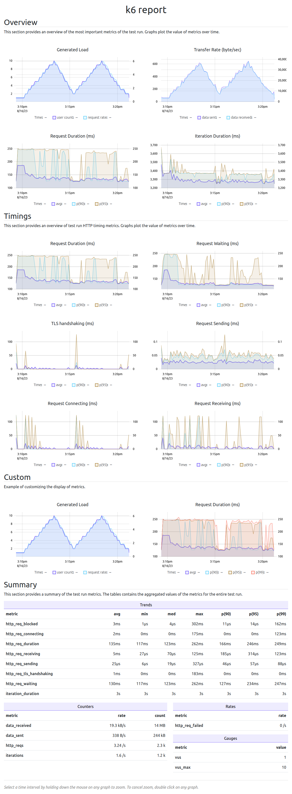

[](https://goreportcard.com/report/github.com/grafana/xk6-dashboard)
[](https://github.com/grafana/xk6-dashboard/actions?query=workflow%3ATest+branch%3Amaster)
[](https://codecov.io/gh/grafana/xk6-dashboard)

[](https://github.com/grafana/xk6-dashboard/releases/)


# xk6-dashboard


A [k6 extension](https://k6.io/docs/extensions/) that that makes [k6](https://k6.io) metrics available on a web-based dashboard. The dashboard is updated continuously during the test run using [server-sent events (SSE)](https://developer.mozilla.org/en-US/docs/Web/API/Server-sent_events/Using_server-sent_events). The test run [report can be exported](#save-report) to a responsive self-contained HTML file, which can be displayed even without an Internet connection.

<details>
<summary><strong>Screenshots</strong></summary>

<details>
<summary><em>Overview</em></summary>

The overview tab provides an overview of the most important metrics of the test run.


</details>

<details>
<summary><em>Timings</em></summary>

The timings tab provides an overview of test run timing metrics.


</details>

<details>
<summary><em>Summary</em></summary>

The summary tab contains a summary of the test run metrics. The tables contain the aggregated values of the metrics for the entire test run.


</details>

<details>
<summary><em>Report</em></summary>

The report can be saved in a single responsive HTML file.

*Single file HTML report*


See [sample HTML report](screenshot/k6-dashboard-html-report.html) or try the [online version](https://raw.githack.com/grafana/xk6-dashboard/master/screenshot/k6-dashboard-html-report.html)

</details>

</details>

**Download**

You can download pre-built k6 binaries from the [Releases](https://github.com/grafana/xk6-dashboard/releases/) page. Check the [Packages](https://github.com/grafana/xk6-dashboard/pkgs/container/xk6-dashboard) page for pre-built k6 Docker images.

<details>
<summary><strong>Build</strong></summary>

The [xk6](https://github.com/grafana/xk6) build tool can be used to build a k6 that will include xk6-faker extension:

```bash
$ xk6 build --with github.com/grafana/xk6-dashboard@latest
```

For more build options and how to use xk6, check out the [xk6 documentation]([xk6](https://github.com/grafana/xk6)).

</details>

## Usage

Without parameters the dashboard will be accessible on port `5665` with any web browser: http://127.0.0.1:5665

```plain
$ ./k6 run --out dashboard script.js

          /\      |‾‾| /‾‾/   /‾‾/   
     /\  /  \     |  |/  /   /  /    
    /  \/    \    |     (   /   ‾‾\  
   /          \   |  |\  \ |  (‾)  | 
  / __________ \  |__| \__\ \_____/ .io

  execution: local
     script: script.js
     output: dashboard http://127.0.0.1:5665
```

The k6 process waits to exit as long as there is at least one open browser window for the dashboard extension. In this way, the report can be downloaded, for example, even after the test has been completed.

In certain environments, it is not allowed that the k6 process does not exit after the test run (eg CI/CD pipeline). In this case, it is advisable to disable the HTTP port (with the `-1` value of  `port` parameter).

## Parameters

The output extension accepts parameters in a standard query string format:

```
k6 run --out 'dashboard=param1=value1&param2=value2&param3=value3'
```

> Note the apostrophes (`'`) around the `--out` parameter! You should use it to escape `&` characters from the shell (or use backslash before `&`).

The following parameters are recognized:

parameter | description
----------|------------
host      | Hostname or IP address for HTTP endpoint (default: "", empty, listen on all interfaces)
port      | TCP port for HTTP endpoint (default: `5665`; `0` = random, `-1` = no HTTP), example: `8080`
period    | Event emitting frequency (default: `10s`), example: `1m`
open      | Set to `true` (or empty) to open the browser window automatically
export    | File name to save the report (default: "", empty, the report will not be saved)
record    | File name to save the dashboard events (default: "", empty, the events will not be saved)
tag       | Precomputed metric tag name(s) (default: "group"), can be specified more than once

## Environment

The dashboard parameters can also be specified in environment variables. The name of the environment variable belonging to the given parameter is created by converting the parameter name to uppercase and adding the `K6_WEB_DASHBOARD_` prefix.

environment variable | description
----------|------------
K6_WEB_DASHBOARD_HOST      | Hostname or IP address for HTTP endpoint (default: "", empty, listen on all interfaces)
K6_WEB_DASHBOARD_PORT      | TCP port for HTTP endpoint (default: `5665`; `0` = random, `-1` = no HTTP), example: `8080`
K6_WEB_DASHBOARD_PERIOD    | Event emitting frequency (default: `10s`), example: `1m`
K6_WEB_DASHBOARD_OPEN      | Set to `true` (or empty) to open the browser window automatically
K6_WEB_DASHBOARD_EXPORT    | File name to save the report (default: "", empty, the report will not be saved)
K6_WEB_DASHBOARD_RECORD    | File name to save the dashboard events (default: "", empty, the events will not be saved)
K6_WEB_DASHBOARD_TAG       | Precomputed metric tag name(s) (default: "group"), can be specified more than once

## Save report

The test run report can be exported to a responsive self-contained HTML file. For export, the file name must be specified in the `export` parameter. If the file name ends with `.gz`, the HTML report will automatically be gzip compressed.

```plain
k6 run --out dashboard=export=test-report.html script.js
```

The exported HTML report file does not contain external dependencies, so it can be displayed even without an Internet connection. Graphs can be zoomed by selecting a time interval. If necessary, the report can be printed or converted to PDF format.

By using the `--export` switch of the `k6-web-dashboard replay` command, the report can also be generated afterwards from the previously saved JSON format result (`--out json=test-result.json`).

The report can also be viewed and downloaded from the dashboard UI using the buttons on the "Report" tab.

```plain
k6-web-dashboard replay --export test-report.html test-result.json
```

<details>
<summary><em>Example HTML report</em></summary>


See [sample HTML report](screenshot/k6-dashboard-html-report.html) or try the [online version](https://raw.githack.com/grafana/xk6-dashboard/master/screenshot/k6-dashboard-html-report.html)

</details>

## Command Line

The CLI tool called [k6-web-dashboard](cmd/k6-web-dashboard/README.md) enables the use of subcommands related to dashboard management (recording playback, creating a report from a recording, etc.) that do not require running k6.

## How it works

You can read more about how the extension works [here](docs/how-it-works.md).

## Contribute

If you want to contribute or help with the development of xk6-dashboard, start by reading [CONTRIBUTING.md](docs/CONTRIBUTING.md). Before you start coding, it might be a good idea to first discuss your plans and implementation details with the xk6-dashboard maintainers—especially when it comes to big changes and features. You can do this in the [GitHub issue](https://github.com/grafana/k6/issues) for the problem you're solving (create one if it doesn't exist).

## Support

To get help, report bugs, suggest features, and discuss k6 with others, refer to [SUPPORT.md](https://github.com/grafana/k6/blob/master/SUPPORT.md).

## License

xk6-dashboard is distributed under the [AGPL-3.0 license](https://github.com/grafana/xk6-dashboard/blob/master/LICENSE.md).

