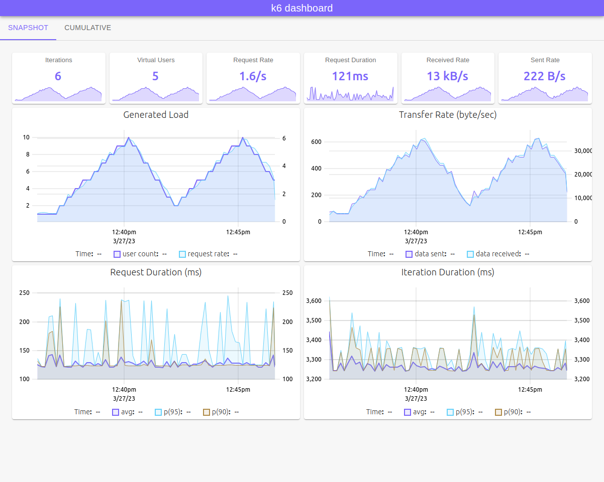
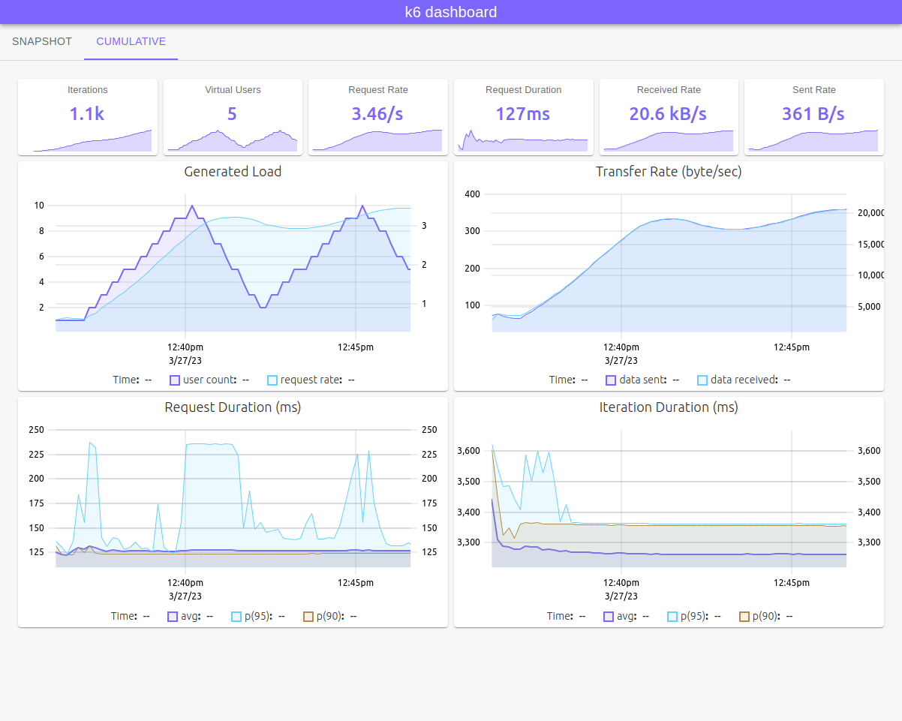

# xk6-dashboard <!-- omit in toc -->

A [k6 extension](https://k6.io/docs/extensions/) that enables creating web based metrics dashboard for [k6](https://k6.io).

By using **xk6-dashboard** output extension you can access metrics from [k6](https://k6.io) process via [Server-sent events (SSE)](https://developer.mozilla.org/en-US/docs/Web/API/Server-sent_events/Using_server-sent_events). All custom [k6](https://k6.io) metrics ([Counter](https://k6.io/docs/javascript-api/k6-metrics/counter/),[Gauge](https://k6.io/docs/javascript-api/k6-metrics/gauge/),[Rate](https://k6.io/docs/javascript-api/k6-metrics/rate/),[Trend](https://k6.io/docs/javascript-api/k6-metrics/trend/)) and [build-in metrics](https://k6.io/docs/using-k6/metrics/#built-in-metrics) will be accessible in the event stream.

**Screenshots**






**Table of Contents**

- [Download](#download)
- [Build](#build)
- [Usage](#usage)
- [Parameters](#parameters)
- [Docker](#docker)
- [Events](#events)

## Download

You can download pre-built k6 binaries from [Releases](https://github.com/szkiba/xk6-dashboard/releases/) page. Check [Packages](https://github.com/szkiba/xk6-dashboard/pkgs/container/xk6-dashboard) page for pre-built k6 Docker images.

## Build

To build a `k6` binary with this extension, first ensure you have the prerequisites:

- [Go toolchain](https://go101.org/article/go-toolchain.html)
- Git

Then:

1. Download `xk6`:
  ```bash
  $ go install go.k6.io/xk6/cmd/xk6@latest
  ```

2. Build the binary:
  ```bash
  $ xk6 build --with github.com/szkiba/xk6-dashboard@latest
  ```

## Usage

Without parameters the dashboard will be accessible on port `5665` with any web browser: http://127.0.0.1:5665

```plain
$ ./k6 run --out dashboard script.js

          /\      |‾‾| /‾‾/   /‾‾/   
     /\  /  \     |  |/  /   /  /    
    /  \/    \    |     (   /   ‾‾\  
   /          \   |  |\  \ |  (‾)  | 
  / __________ \  |__| \__\ \_____/ .io

  execution: local
     script: script.js
     output: dashboard (:5665) http://127.0.0.1:5665
```

> Using `--out dashboard=open` will automatically open a new browser window.

## Parameters

The output extension accepts parameters in a standard query string format:

```
k6 run --out 'dashboard=param1=value1&param2=value2&param3=value3'
```

> Note apostrophe (`'`) characters around the `--out` parameter! You should use it for escape `&` characters from shell (or use backslash before `&` characters).

The following parameters are recognized:

parameter | description
----------|------------
host      | Hostname or IP address for HTTP endpoint (default: "", empty, listen on all interfaces)
port      | TCP port for HTTP endpoint (default: `5665`), example: `8080`
period    | Event emitting frequency (default: `10s`), example: `1m`
open      | Set to `true` (or empty) for opening browser window automatically

## Docker

You can also use pre-built k6 image within a Docker container. In order to do that, you will need to execute something like the following:

**Linux**

```plain
docker run -v $(pwd):/scripts -p 5665:5665 -it --rm ghcr.io/szkiba/xk6-dashboard:latest run --out=dashboard /scripts/script.js
```

**Windows**

```plain
docker run -v %cd%:/scripts -p 5665:5665 -it --rm ghcr.io/szkiba/xk6-dashboard:latest run --out=dashboard /scripts/script.js
```

The dashboard will accessible on port `5665` with any web browser: http://127.0.0.1:5665

## Events

The `/events` endpoint (default: http://127.0.0.1:5665/events) is a standard SSE event source endpoint. Using this event source you can create your own dashboard UI.

Events will be emitted periodically, based on `period` parameter (default: `10s`). The event's `data` is a JSON object, with metric names as property names and metric values as property values. The format is similar to [List Metrics](https://k6.io/docs/misc/k6-rest-api/#list-metrics) response format from [k6 REST API](https://k6.io/docs/misc/k6-rest-api/).

Two kind of events will be emitted:
  - `snapshot` contains metric values from last period
  - `cumulative` contains cumulative metric values from the test starting point

**Example events**

```plain
event: snapshot
data: {"checks":{"type":"rate","contains":"default","tainted":null,"sample":{"rate":0}},"data_received":{"type":"counter","contains":"data","tainted":null,"sample":{"count":11839,"rate":5919.5}},"data_sent":{"type":"counter","contains":"data","tainted":null,"sample":{"count":202,"rate":101}},"http_req_blocked":{"type":"trend","contains":"time","tainted":null,"sample":{"avg":0.0037155,"max":0.00485,"med":0.0037155,"min":0.002581,"p(90)":0.0046231,"p(95)":0.00473655}},"http_req_connecting":{"type":"trend","contains":"time","tainted":null,"sample":{"avg":0,"max":0,"med":0,"min":0,"p(90)":0,"p(95)":0}},"http_req_duration":{"type":"trend","contains":"time","tainted":null,"sample":{"avg":120.917558,"max":120.928988,"med":120.917558,"min":120.906128,"p(90)":120.926702,"p(95)":120.927845}},"http_req_failed":{"type":"rate","contains":"default","tainted":null,"sample":{"rate":0}},"http_req_receiving":{"type":"trend","contains":"time","tainted":null,"sample":{"avg":0.0709745,"max":0.088966,"med":0.0709745,"min":0.052983,"p(90)":0.0853677,"p(95)":0.08716685}},"http_req_sending":{"type":"trend","contains":"time","tainted":null,"sample":{"avg":0.022489500000000003,"max":0.033272,"med":0.022489500000000003,"min":0.011707,"p(90)":0.031115500000000004,"p(95)":0.03219375}},"http_req_tls_handshaking":{"type":"trend","contains":"time","tainted":null,"sample":{"avg":0,"max":0,"med":0,"min":0,"p(90)":0,"p(95)":0}},"http_req_waiting":{"type":"trend","contains":"time","tainted":null,"sample":{"avg":120.824094,"max":120.841438,"med":120.824094,"min":120.80675,"p(90)":120.8379692,"p(95)":120.83970359999999}},"http_reqs":{"type":"counter","contains":"default","tainted":null,"sample":{"count":2,"rate":1}},"iteration_duration":{"type":"trend","contains":"time","tainted":null,"sample":{"avg":3244.614784,"max":3244.614784,"med":3244.614784,"min":3244.614784,"p(90)":3244.614784,"p(95)":3244.614784}},"iterations":{"type":"counter","contains":"default","tainted":null,"sample":{"count":1,"rate":0.5}},"time":{"type":"gauge","contains":"time","tainted":null,"sample":{"value":1679907081015}},"vus":{"type":"gauge","contains":"default","tainted":null,"sample":{"value":1}},"vus_max":{"type":"gauge","contains":"default","tainted":null,"sample":{"value":2}}}

event: cumulative
data: {"checks":{"type":"rate","contains":"default","tainted":null,"sample":{"rate":0}},"data_received":{"type":"counter","contains":"data","tainted":null,"sample":{"count":46837,"rate":1115.1362807429666}},"data_sent":{"type":"counter","contains":"data","tainted":null,"sample":{"count":1653,"rate":39.35607045857172}},"http_req_blocked":{"type":"trend","contains":"time","tainted":null,"sample":{"avg":88.12648020000002,"max":456.345376,"med":0.0056419999999999994,"min":0.00219,"p(90)":262.8713841999999,"p(95)":359.60838009999975}},"http_req_connecting":{"type":"trend","contains":"time","tainted":null,"sample":{"avg":37.2988213,"max":131.097342,"med":0,"min":0,"p(90)":122.40998579999999,"p(95)":126.75366389999999}},"http_req_duration":{"type":"trend","contains":"time","tainted":null,"sample":{"avg":123.92543040000001,"max":133.508481,"med":121.77833150000001,"min":120.412089,"p(90)":132.29845799999998,"p(95)":132.9034695}},"http_req_failed":{"type":"rate","contains":"default","tainted":null,"sample":{"rate":0.2}},"http_req_receiving":{"type":"trend","contains":"time","tainted":null,"sample":{"avg":0.10157959999999999,"max":0.337678,"med":0.0826445,"min":0.052983,"p(90)":0.11383719999999992,"p(95)":0.22575759999999973}},"http_req_sending":{"type":"trend","contains":"time","tainted":null,"sample":{"avg":0.035149900000000005,"max":0.096238,"med":0.0272325,"min":0.011707,"p(90)":0.06422679999999999,"p(95)":0.08023239999999997}},"http_req_tls_handshaking":{"type":"trend","contains":"time","tainted":null,"sample":{"avg":38.9789687,"max":268.92473,"med":0,"min":0,"p(90)":135.67093429999994,"p(95)":202.29783214999986}},"http_req_waiting":{"type":"trend","contains":"time","tainted":null,"sample":{"avg":123.78870090000001,"max":133.411013,"med":121.5094465,"min":120.326814,"p(90)":132.15912649999999,"p(95)":132.78506975}},"http_reqs":{"type":"counter","contains":"default","tainted":null,"sample":{"count":10,"rate":0.23808875050557607}},"iteration_duration":{"type":"trend","contains":"time","tainted":null,"sample":{"avg":3626.924762,"max":4258.763721,"med":3377.395781,"min":3244.614784,"p(90)":4082.4901330000002,"p(95)":4170.626927}},"iterations":{"type":"counter","contains":"default","tainted":null,"sample":{"count":3,"rate":0.07142662515167282}},"time":{"type":"gauge","contains":"time","tainted":null,"sample":{"value":1679907081015}},"vus":{"type":"gauge","contains":"default","tainted":null,"sample":{"value":1}},"vus_max":{"type":"gauge","contains":"default","tainted":null,"sample":{"value":2}}}
```

