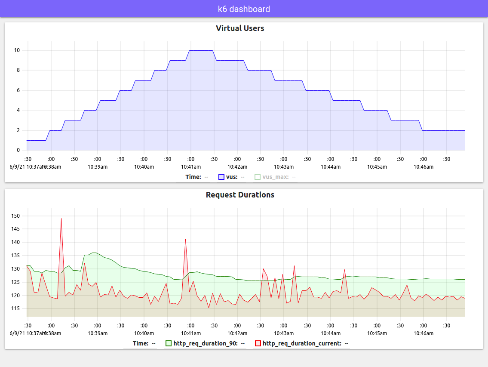

# xk6-dashboard

A k6 extension that enables creating web based metrics dashboard for k6.

Using **xk6-dashboard** output extension you can access metrics from k6 process via [Server-sent events (sse)](https://developer.mozilla.org/en-US/docs/Web/API/Server-sent_events/Using_server-sent_events). All custom k6 metrics ([Counter](https://k6.io/docs/javascript-api/k6-metrics/counter/),[Gauge](https://k6.io/docs/javascript-api/k6-metrics/gauge/),[Rate](https://k6.io/docs/javascript-api/k6-metrics/rate/),[Trend](https://k6.io/docs/javascript-api/k6-metrics/trend/)) and [build-in metrics](https://k6.io/docs/using-k6/metrics/#built-in-metrics) will be accessible in event stream.

## Features

- customizable web based UI
- UI is updatable without recompiling k6 binary
- customizable event frequency
- metrics description endpoint
- SSE event stream endpoint
- Prometheus HTTP exporter endpoint
- reasonable defaults

**Example screenshot**



Built for [k6](https://go.k6.io/k6) using [xk6](https://github.com/grafana/xk6).

<!-- START doctoc generated TOC please keep comment here to allow auto update -->
<!-- DON'T EDIT THIS SECTION, INSTEAD RE-RUN doctoc TO U PDATE -->
**Table of Contents**

- [Build](#build)
- [Usage](#usage)
  - [With defaults](#with-defaults)
  - [Parameters](#parameters)
- [UI](#ui)
- [Endpoints](#endpoints)
  - [Events](#events)
  - [Metrics](#metrics)
  - [Prometheus](#prometheus)

<!-- END doctoc generated TOC please keep comment here to allow auto update -->

## Build

To build a `k6` binary with this extension, first ensure you have the prerequisites:

- [Go toolchain](https://go101.org/article/go-toolchain.html)
- Git

Then:

1. Download `xk6`:
  ```bash
  $ go install go.k6.io/xk6/cmd/xk6@latest
  ```

2. Build the binary:
  ```bash
  $ xk6 build --with github.com/szkiba/xk6-dashboard@latest
  ```

> You should use at least `v0.31.0` version because xk6-dashboard extension registers itself as output extension. This feature introduced in the `v0.31.0` version of k6.

## Usage

### With defaults

Without parameters the dashboard will accessible on port `5665` with any web browser: http://127.0.0.1:5665

```plain
$ ./k6 run --out dashboard script.js

          /\      |‾‾| /‾‾/   /‾‾/   
     /\  /  \     |  |/  /   /  /    
    /  \/    \    |     (   /   ‾‾\  
   /          \   |  |\  \ |  (‾)  | 
  / __________ \  |__| \__\ \_____/ .io

  execution: local
     script: script.js
     output: dashboard (:5665)
```

### Parameters

The output extension accept parameters in a standard query string format:

```
k6 run --out 'dashboard=param1=value1&param2=value2&param3=value3'
```

> Note apostrophe (`'`) characters around the `--out` parameter! You should use it for escape `&` characters from shell (or use backslash before `&` characters).

The following paremeters are recognized:

parameter | description
----------|------------
host      | Hostname or IP address for HTTP endpoint (default: "", empty, listen on all interfaces)
port      | TCP port for HTTP endoint (default: 5665)
ui        | URL of web based UI (default: https://xk6-dashboard.netlify.app/)
period    | Event emiting frequency in seconds (default: 10)

*You can ommit the `https://` part from the begining of the `ui` parameter since it is the default.*

## UI

The default UI is https://xk6-dashboard.netlify.app/ which can be overwritten with `ui` parameter. You can specify any URL accessible from your browser, even URL accessible only from your internal network.

When you open the dashboard (default at http://127.0.0.1:5665) then it will redirect to URL specified in `ui` parameter. The actual dashboard URL will be passed to UI as `endpoint` query parameter. For example with default UI, your browser will be redirected to:

```plain
https://xk6-dashboard.netlify.app/?endpoint=http%3A%2F%2F127.0.0.1%3A5665%2F
```

You can create your own dashboard UI and pass it's URL in `ui` parameter. The source code for default UI can be found in [ui](ui) directory. It is a simple static web page, can be hosted at any web hosting provider.

> The default UI currently in very early state, will be improved soon. Since UI is not bundled into extension, you do not need to recompile k6 binary to get new UI version.

## Endpoints

### Events

The `/events/sample` endpoint is a standard SSE event source endpoint. Events will be emitted periodically. The event's `data` is a JSON object, with metric names as property names and metric values as property values.

```plain
data: {"data_received":1121204,"data_sent":7524,"http_req_blocked":178.923243,"http_req_blocked_50":0.003447,"http_req_blocked_90":0.019837,"http_req_blocked_95":118.012118,"http_req_blocked_current":0.003012,"http_req_connecting":124.836208,"http_req_connecting_95":117.970892,"http_req_connecting_current":0,"http_req_duration":130.294312,"http_req_duration_50":119.659944,"http_req_duration_90":122.807487,"http_req_duration_95":123.13075,"http_req_duration_current":119.954027,"http_req_receiving":1.771721,"http_req_receiving_50":0.806023,"http_req_receiving_90":0.881438,"http_req_receiving_95":0.896281,"http_req_receiving_current":0.839794,"http_req_sending":0.107586,"http_req_sending_50":0.013284,"http_req_sending_90":0.051893,"http_req_sending_95":0.073421,"http_req_sending_current":0.007599,"http_req_tls_handshaking_current":0,"http_req_waiting":129.402686,"http_req_waiting_50":118.842085,"http_req_waiting_90":121.965269,"http_req_waiting_95":122.309601,"http_req_waiting_current":119.106634,"http_reqs":109,"iteration_duration":3310.509552,"iteration_duration_50":3120.80346,"iteration_duration_90":3229.442573,"iteration_duration_95":3241.943796,"iteration_duration_current":3120.28348,"iterations":99,"vus":10,"vus_max":10}
```

### Metrics

The `/api/metrics` returns the metrics descriptions in JSON format.

```json
{
  "data_received": { "type": "counter", "help": "The amount of received data" },
  "data_sent": { "type": "counter", "help": "The amount of data sent" },
  "http_req_blocked": { "type": "summary", "help": "Time spent blocked  before initiating the request" },
  "http_req_blocked_current": { "type": "gauge", "help": "Time spent blocked  before initiating the request (current)" },
  "http_req_connecting": { "type": "summary", "help": "Time spent establishing TCP connection" },
  "http_req_connecting_current": { "type": "gauge", "help": "Time spent establishing TCP connection (current)" },
  "http_req_duration": { "type": "summary", "help": "Total time for the request" },
  "http_req_duration_current": { "type": "gauge", "help": "Total time for the request (current)" },
  "http_req_failed": { "type": "histogram", "help": "The rate of failed requests" },
  "http_req_receiving": { "type": "summary", "help": "Time spent receiving response data" },
  "http_req_receiving_current": { "type": "gauge", "help": "Time spent receiving response data (current)" },
  "http_req_sending": { "type": "summary", "help": "Time spent sending data" },
  "http_req_sending_current": { "type": "gauge", "help": "Time spent sending data (current)" },
  "http_req_tls_handshaking": { "type": "summary", "help": "Time spent handshaking TLS session" },
  "http_req_tls_handshaking_current": { "type": "gauge", "help": "Time spent handshaking TLS session (current)" },
  "http_req_waiting": { "type": "summary", "help": "Time spent waiting for response" },
  "http_req_waiting_current": { "type": "gauge", "help": "Time spent waiting for response (current)" },
  "http_reqs": { "type": "counter", "help": "How many HTTP requests has k6 generated, in total" },
  "iteration_duration": { "type": "summary", "help": "The time it took to complete one full iteration" },
  "iteration_duration_current": { "type": "gauge", "help": "The time it took to complete one full iteration (current)" },
  "iterations": { "type": "counter", "help": "The aggregate number of times the VUs in the test have executed" },
  "vus": { "type": "gauge", "help": "Current number of active virtual users" },
  "vus_max": { "type": "gauge", "help": "Max possible number of virtual users" }
}
```

### Prometheus

The `/api/prometheus` endpoint is a standard Prometheus HTTP exporter endpoint.

```plain
# HELP data_received The amount of received data
# TYPE data_received counter
data_received 1.00803e+06
# HELP data_sent The amount of data sent
# TYPE data_sent counter
data_sent 6764
# HELP http_req_blocked Time spent blocked  before initiating the request
# TYPE http_req_blocked summary
http_req_blocked{quantile="0.5"} 0.003389
http_req_blocked{quantile="0.9"} 137.227212
http_req_blocked{quantile="0.95"} 154.179003
http_req_blocked{quantile="1"} 199.453901
http_req_blocked_sum 1560.8951499999996
http_req_blocked_count 99
# HELP http_req_blocked_current Time spent blocked  before initiating the request (current)
# TYPE http_req_blocked_current gauge
http_req_blocked_current 0.002103
# HELP http_req_connecting Time spent establishing TCP connection
# TYPE http_req_connecting summary
http_req_connecting{quantile="0.5"} 0
http_req_connecting{quantile="0.9"} 137.187094
http_req_connecting{quantile="0.95"} 152.076758
http_req_connecting{quantile="1"} 159.766749
http_req_connecting_sum 1510.590024
http_req_connecting_count 99
# HELP http_req_connecting_current Time spent establishing TCP connection (current)
# TYPE http_req_connecting_current gauge
http_req_connecting_current 0
# HELP http_req_duration Total time for the request
# TYPE http_req_duration summary
http_req_duration{quantile="0.5"} 147.955703
http_req_duration{quantile="0.9"} 164.45893
http_req_duration{quantile="0.95"} 165.382749
http_req_duration{quantile="1"} 174.141232
http_req_duration_sum 14891.903182000002
http_req_duration_count 99
# HELP http_req_duration_current Total time for the request (current)
# TYPE http_req_duration_current gauge
http_req_duration_current 146.537304
# HELP http_req_failed The rate of failed requests
# TYPE http_req_failed histogram
http_req_failed_bucket{le="0"} 99
http_req_failed_bucket{le="+Inf"} 99
http_req_failed_sum 0
http_req_failed_count 99
# HELP http_req_receiving Time spent receiving response data
# TYPE http_req_receiving summary
http_req_receiving{quantile="0.5"} 0.79247
http_req_receiving{quantile="0.9"} 0.849454
http_req_receiving{quantile="0.95"} 0.858977
http_req_receiving{quantile="1"} 0.883411
http_req_receiving_sum 78.37099299999998
http_req_receiving_count 99
# HELP http_req_receiving_current Time spent receiving response data (current)
# TYPE http_req_receiving_current gauge
http_req_receiving_current 0.834642
# HELP http_req_sending Time spent sending data
# TYPE http_req_sending summary
http_req_sending{quantile="0.5"} 0.013691
http_req_sending{quantile="0.9"} 0.042305
http_req_sending{quantile="0.95"} 0.058907
http_req_sending{quantile="1"} 0.090475
http_req_sending_sum 1.8473540000000006
http_req_sending_count 99
# HELP http_req_sending_current Time spent sending data (current)
# TYPE http_req_sending_current gauge
http_req_sending_current 0.008169
# HELP http_req_tls_handshaking Time spent handshaking TLS session
# TYPE http_req_tls_handshaking summary
http_req_tls_handshaking{quantile="0.5"} 0
http_req_tls_handshaking{quantile="0.9"} 0
http_req_tls_handshaking{quantile="0.95"} 0
http_req_tls_handshaking{quantile="1"} 0
http_req_tls_handshaking_sum 0
http_req_tls_handshaking_count 99
# HELP http_req_tls_handshaking_current Time spent handshaking TLS session (current)
# TYPE http_req_tls_handshaking_current gauge
http_req_tls_handshaking_current 0
# HELP http_req_waiting Time spent waiting for response
# TYPE http_req_waiting summary
http_req_waiting{quantile="0.5"} 147.199375
http_req_waiting{quantile="0.9"} 163.664925
http_req_waiting{quantile="0.95"} 164.613257
http_req_waiting{quantile="1"} 173.261477
http_req_waiting_sum 14811.684835000007
http_req_waiting_count 99
# HELP http_req_waiting_current Time spent waiting for response (current)
# TYPE http_req_waiting_current gauge
http_req_waiting_current 145.694493
# HELP http_reqs How many HTTP requests has k6 generated, in total
# TYPE http_reqs counter
http_reqs 99
# HELP iteration_duration The time it took to complete one full iteration
# TYPE iteration_duration summary
iteration_duration{quantile="0.5"} 3150.669295
iteration_duration{quantile="0.9"} 3291.149615
iteration_duration{quantile="0.95"} 3315.50851
iteration_duration{quantile="1"} 3341.782155
iteration_duration_sum 282016.458391
iteration_duration_count 89
# HELP iteration_duration_current The time it took to complete one full iteration (current)
# TYPE iteration_duration_current gauge
iteration_duration_current 3166.87982
# HELP iterations The aggregate number of times the VUs in the test have executed
# TYPE iterations counter
iterations 89
# HELP vus Current number of active virtual users
# TYPE vus gauge
vus 10
# HELP vus_max Max possible number of virtual users
# TYPE vus_max gauge
vus_max 10
```
