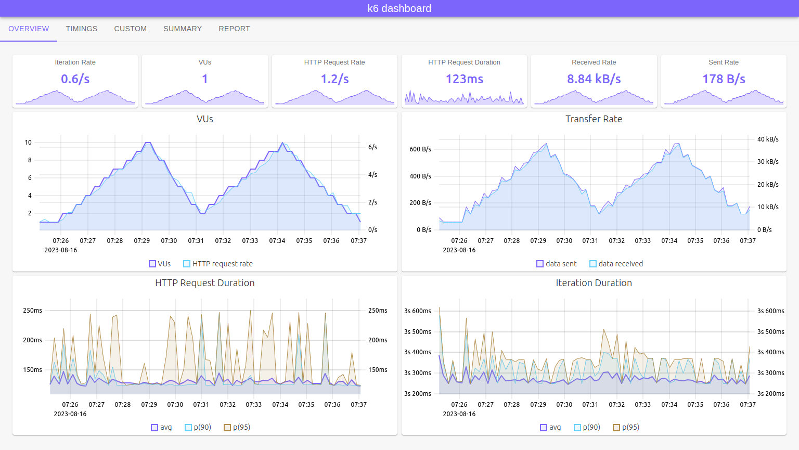
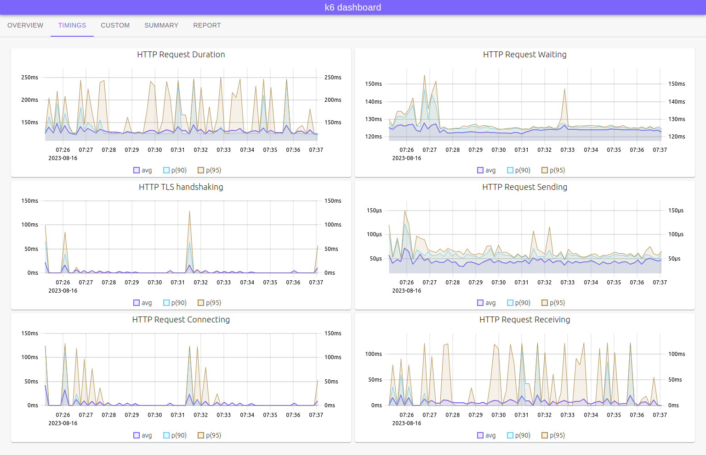
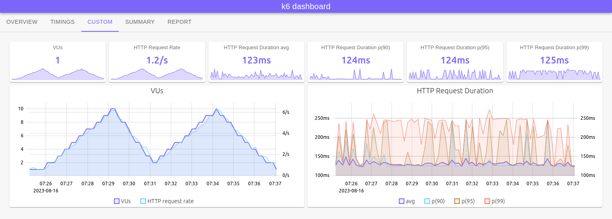

<!--
SPDX-FileCopyrightText: 2023 Raintank, Inc. dba Grafana Labs

SPDX-License-Identifier: AGPL-3.0-only
-->

[](https://goreportcard.com/report/github.com/grafana/xk6-dashboard)
[](https://github.com/grafana/xk6-dashboard/actions?query=workflow%3ATest+branch%3Amaster)
[](https://codecov.io/gh/szkiba/xk6-dashboard)
[](https://api.reuse.software/info/github.com/grafana/xk6-dashboard)


# xk6-dashboard <!-- omit in toc -->

A [k6 extension](https://k6.io/docs/extensions/) that enables creating a web based metrics dashboard for [k6](https://k6.io).

By using the **xk6-dashboard** output extension you can access metrics from [k6](https://k6.io) process via [server-sent events (SSE)](https://developer.mozilla.org/en-US/docs/Web/API/Server-sent_events/Using_server-sent_events). All custom [k6](https://k6.io) metrics ([Counter](https://k6.io/docs/javascript-api/k6-metrics/counter/), [Gauge](https://k6.io/docs/javascript-api/k6-metrics/gauge/), [Rate](https://k6.io/docs/javascript-api/k6-metrics/rate/), [Trend](https://k6.io/docs/javascript-api/k6-metrics/trend/)) and [built-in metrics](https://k6.io/docs/using-k6/metrics/#built-in-metrics) are accessible in the event stream.

The test run report can be exported to a responsive self-contained HTML file, which can be displayed even without an Internet connection.

**Screenshots**

*Overview*

The overview tab provides an overview of the most important metrics of the test run. Graphs plot the value of metrics over time.



*Timings*

The timings tab provides an overview of test run HTTP timing metrics. Graphs plot the value of metrics over time.



*Custom Tab*

Example of customizing the display of metrics.



*Summary Tab*

The summary tab contains a summary of the test run metrics. The tables contain the aggregated values of the metrics for the entire test run.


**Report**

The report tab contains a test run report in a printable (or saveable to PDF) format.

*Report Tab*


*Report PDF*

See [sample PDF report](screenshot/k6-dashboard-report.pdf).

**HTML Report**

The report can be saved in a single responsive HTML file.

*Single file HTML report*


See [sample HTML report](screenshot/k6-dashboard-html-report.html) or try the [online version](https://raw.githack.com/grafana/xk6-dashboard/master/screenshot/k6-dashboard-html-report.html)

**Table of Contents**

- [Download](#download)
- [Build](#build)
- [Usage](#usage)
- [Exit](#exit)
- [Parameters](#parameters)
- [Docker](#docker)
- [Save report](#save-report)
- [Events](#events)
- [Customization](#customization)
  - [Examples](#examples)
- [Command Line](#command-line)
  - [Docker](#docker-1)

## Download

You can download pre-built k6 binaries from the [Releases](https://github.com/grafana/xk6-dashboard/releases/) page. Check the [Packages](https://github.com/grafana/xk6-dashboard/pkgs/container/xk6-dashboard) page for pre-built k6 Docker images.

## Build

To build a `k6` binary with this extension, first ensure you have the prerequisites:

- [Go toolchain](https://go101.org/article/go-toolchain.html)
- Git

Then:

1. Download `xk6`:
  ```bash
  $ go install go.k6.io/xk6/cmd/xk6@latest
  ```

2. Build the binary:
  ```bash
  $ xk6 build --with github.com/grafana/xk6-dashboard@latest
  ```

## Usage

Without parameters the dashboard will be accessible on port `5665` with any web browser: http://127.0.0.1:5665

```plain
$ ./k6 run --out dashboard script.js

          /\      |‾‾| /‾‾/   /‾‾/   
     /\  /  \     |  |/  /   /  /    
    /  \/    \    |     (   /   ‾‾\  
   /          \   |  |\  \ |  (‾)  | 
  / __________ \  |__| \__\ \_____/ .io

  execution: local
     script: script.js
     output: dashboard (:5665) http://127.0.0.1:5665
```

> Using `--out dashboard=open` will automatically open a new browser window.

## Exit

The k6 process waits to exit as long as there is at least one open browser window for the dashboard extension. In this way, the report can be downloaded, for example, even after the test has been completed.

In certain environments, it is not allowed that the k6 process does not exit after the test run (eg CI/CD pipeline). In this case, it is advisable to disable the HTTP port (with the `-1` value of  `port` parameter).

## Parameters

The output extension accepts parameters in a standard query string format:

```
k6 run --out 'dashboard=param1=value1&param2=value2&param3=value3'
```

> Note the apostrophes (`'`) around the `--out` parameter! You should use it to escape `&` characters from the shell (or use backslash before `&`).

The following parameters are recognized:

parameter | description
----------|------------
host      | Hostname or IP address for HTTP endpoint (default: "", empty, listen on all interfaces)
port      | TCP port for HTTP endpoint (default: `5665`; `0` = random, `-1` = no HTTP), example: `8080`
period    | Event emitting frequency (default: `10s`), example: `1m`
open      | Set to `true` (or empty) to open the browser window automatically
report    | File name to save the report (default: "", empty, the report will not be saved)
record    | File name to save the dashboard events (default: "", empty, the events will not be saved)
tag       | Precomputed metric tag name(s) (default: "group"), can be specified more than once

## Docker

You can also use pre-built k6 image within a Docker container. In order to do that you will need to execute something like the following:

**Linux**

```plain
docker run -v $(pwd):/scripts -p 5665:5665 -it --rm ghcr.io/grafana/xk6-dashboard:latest run --out=dashboard /scripts/script.js
```

**Windows**

```plain
docker run -v %cd%:/scripts -p 5665:5665 -it --rm ghcr.io/grafana/xk6-dashboard:latest run --out=dashboard /scripts/script.js
```

The dashboard will accessible on port `5665` with any web browser: http://127.0.0.1:5665

## Save report

The test run report can be exported to a responsive self-contained HTML file. For export, the file name must be specified in the `report` parameter. If the file name ends with `.gz`, the HTML report will automatically be gzip compressed.

```plain
k6 run --out dashboard=report=test-report.html script.js
```

The exported HTML report file does not contain external dependencies, so it can be displayed even without an Internet connection. Graphs can be zoomed by selecting a time interval. If necessary, the report can be printed or converted to PDF format.

By using the `--report` switch of the `dashboard replay` command, the report can also be generated afterwards from the previously saved JSON format result (`--out json=test-result.json`).

The report can also be viewed and downloaded from the dashboard UI using the buttons on the "Report" tab.

```plain
k6 dashboard replay --report test-report.html test-result.json
```

*Example HTML report*


See [sample HTML report](screenshot/k6-dashboard-html-report.html) or try the [online version](https://raw.githack.com/grafana/xk6-dashboard/master/screenshot/k6-dashboard-html-report.html)

## Events

The `/events` endpoint (default: http://127.0.0.1:5665/events) is a standard SSE source endpoint. Using this event source you can create your own dashboard UI.

Events will be emitted periodically based on the `period` parameter (default: `10s`). The event's `data` is a JSON object with metric names as property names and metric values as property values. The format is similar to the [List Metrics](https://k6.io/docs/misc/k6-rest-api/#list-metrics) response format from the [k6 REST API](https://k6.io/docs/misc/k6-rest-api/).

Two kind of events will be emitted:
  - `config` contains ui configuration
  - `param` contains main extension parameters (period, scenarios, thresholds, etc)
  - `start` contains start timestamp
  - `stop` contains stop timestamp
  - `metric` contains new metric definitions
  - `snapshot` contains metric values from last period
  - `cumulative` contains cumulative metric values from the test starting point

## Customization

The embedded user interface can be customized using a single JavaScript configuration file specified in the `XK6_DASHBOARD_CONFIG` environment variable (default: `.dashboard.js` in the current directory). The configuration file is an ES6 module. The module's default export is a JavaScript function which returns a configuration object. The default configuration is passed as argument to the exported function.

The default configuration is loaded from the [dashboard/assets/packages/config/dist/config.json](assets/packages/config/dist/config.json) file, which can give you ideas for creating your own configuration.

> **Warning**
> The format of the custom configuration has changed!
> The stability of the configuration format is still not guaranteed, so you should check the changes before updating the version.
> In addition, it is possible that the custom configuration will be limited or phased out in the future.

### Examples

**Custom tab**


In this example, a tab called *Custom* is defined, which contains six panels and two charts. The first two panels are just a reference to the two panels of the built-in *Overview* tab.

```js
export default function (config) {
  Array.prototype.getById = function (id) {
    return this.filter(element => element.id == id).at(0)
  }

  // helper for adding p(99) to existing chart
  function addP99 (chart) {
    chart.series = Object.assign({}, chart.series)
    chart.series['http_req_duration.p(99)'] = { label: 'p(99)', format: 'duration' }
  }

  // define request duration panel
  function durationPanel (suffix) {
    return {
      id: `http_req_duration_${suffix}`,
      title: `HTTP Request Duration ${suffix}`,
      metric: `http_req_duration.${suffix}`,
      format: 'duration'
    }
  }
  
  // copy vus and http_reqs panel from default config
  const overview = config.tabs.getById('overview_snapshot')

  // define custom panels
  const customPanels = [
    overview.panels.getById('vus'),
    overview.panels.getById('http_reqs'),
    durationPanel('avg'),
    durationPanel('p(90)'),
    durationPanel('p(95)'),
    durationPanel('p(99)')
  ]

  // copy http_req_duration chart form default config...
  const durationChart = Object.assign({}, overview.charts.getById('http_req_duration'))

  // ... and add p(99)
  addP99(durationChart)

  // define custom tab
  const customTab = {
    id: 'custom',
    title: 'Custom',
    event: overview.event,
    panels: customPanels,
    charts: [overview.charts.getById('http_reqs'), durationChart],
    description: 'Example of customizing the display of metrics.'
  }

  // add custom tab to configuration
  config.tabs.push(customTab)

  return config
}
```

**p(99)**

In this example, the 99th percentile value is added to the *Request Duration* chart on the built-in *Overview* tabs.

```js
export default function (config) {
  Array.prototype.getById = function (id) {
    return this.filter((element) => element.id == id).at(0);
  };

  // helper for adding p(99) to existing chart
  function addP99(chart) {
    chart.series["http_req_duration.p(99)"] = { label: "p(99)" };
  }

  // add p(99) to overview panels request duration charts
  addP99(config.tabs.getById("overview_snapshot").charts.getById("http_req_duration"));

  return config
}
```

## Command Line

The xk6-dashboard extension adds a `dashboard` command to the k6 command line:

```sh
$ ./k6 dashboard --help

xk6-dashboard commands

Usage:
  k6 dashboard [command]

Available Commands:
  aggregate   convert saved json output to recorded dashboard events
  replay      load the recorded dashboard events and replay it for the UI
  report      create report from a recorded event file  

Flags:
  -h, --help   help for dashboard

Use "k6 dashboard [command] --help" for more information about a command.
```

At the moment, the `dashboard` command has three subcommand, `replay` (which can be used to play back dashboard events previously saved with `record` parameter), `aggregate` (which can be used to convert test run results previously saved in JSON format from k6 to dashboard events format NDJSON) and `report` (which can be used to generate report from dashboard events previously saved with `record` parameter).


```sh
$ ./k6 dashboard replay --help

The replay command load the recorded dashboard events (NDJSON format) and replay it for the dashboard UI.
The compressed file will be automatically decompressed if the file extension is .gz

Usage:
  k6 dashboard replay file [flags]

Flags:
      --host string     Hostname or IP address for HTTP endpoint (default: '', empty, listen on all interfaces)
      --open            Open browser window automatically
      --port int        TCP port for HTTP endpoint (0=random, -1=no HTTP), example: 8080 (default 5665)
      --report string   Report file location (default: '', no report)
  -h, --help            help for replay
```

```
$ ./k6 dashboard aggregate --help

The aggregate command converts the file saved by json output to dashboard format events file.
The files will be automatically compressed/decompressed if the file extension is .gz

Usage:
  k6 dashboard aggregate input-file output-file [flags]

Flags:
      --period 1m      Event emitting frequency, example: 1m (default 10s)
      --tags strings   Precomputed metric tags, can be specified more than once (default [group])
  -h, --help           help for aggregate
```

```
$ ./k6 dashboard report --help

The report command loads recorded dashboard events (NDJSON format) and creates a report.
The compressed events file will be automatically decompressed if the file extension is .gz

Usage:
  k6 dashboard report events-file report-file [flags]

Flags:
      --open   Open browser window with generated report
  -h, --help   help for report
```

To visualize the result of a previous test run (using events file):

```
./k6 run --out dashboard=record=test_result.ndjson script.js
./k6 dashboard replay test_result.ndjson
```

To visualize the result of a previous test run (using json output):

```sh
./k6 run --out json=test_result.json script.js
./k6 dashboard aggregate test_result.json test_result.ndjson
./k6 dashboard replay test_result.ndjson
```

To generate report from previous test run (using events file):

```
./k6 run --out dashboard=record=test_result.ndjson script.js
./k6 dashboard report test_result.ndjson test_result_report.html
```

### Docker

You can also use pre-built k6 image within a Docker container. In order to do that, you will need to execute something like the following:

**Linux**

```plain
docker run -v $(pwd):/work -v /tmp:/tmp/work -it --rm ghcr.io/grafana/xk6-dashboard:latest run --out=json=/tmp/work/test_result.json.gz /work/script.js
docker run -v /tmp:/tmp/work -p 5665:5665 -it --rm ghcr.io/grafana/xk6-dashboard:latest dashboard replay /tmp/work/test_result.json.gz
```

**Windows**

```plain
docker run -v %cd%:/work -v %USERPROFILE%\AppData\Local\Temp:/tmp/work -it --rm ghcr.io/grafana/xk6-dashboard:latest run --out=json=/tmp/work/test_result.json.gz /work/script.js
docker run -v %USERPROFILE%\AppData\Local\Temp:/tmp/work -p 5665:5665 -it --rm ghcr.io/grafana/xk6-dashboard:latest dashboard replay /tmp/work/test_result.json.gz
```

The dashboard will accessible on port `5665` with any web browser: http://127.0.0.1:5665
