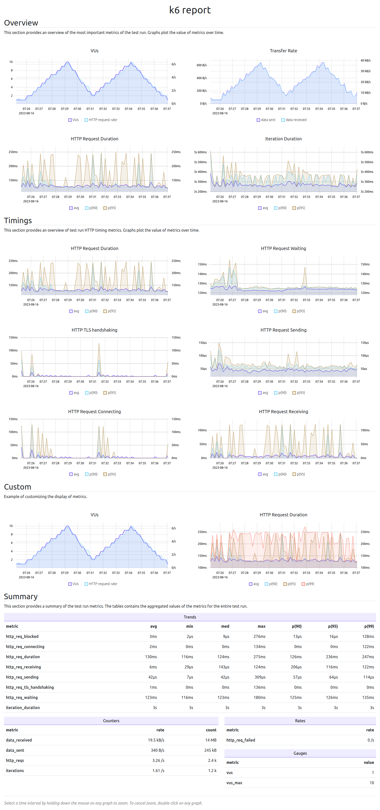
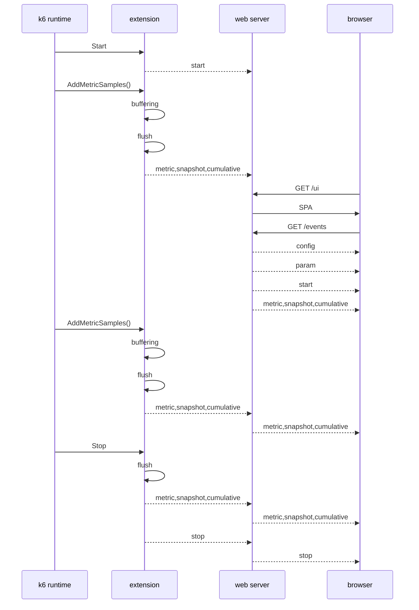

<!--
SPDX-FileCopyrightText: 2023 Raintank, Inc. dba Grafana Labs

SPDX-License-Identifier: AGPL-3.0-only
-->

[](https://goreportcard.com/report/github.com/grafana/xk6-dashboard)
[](https://github.com/grafana/xk6-dashboard/actions?query=workflow%3ATest+branch%3Amaster)
[](https://codecov.io/gh/grafana/xk6-dashboard)


# xk6-dashboard <!-- omit in toc -->

A [k6 extension](https://k6.io/docs/extensions/) that that makes [k6](https://k6.io) metrics available on a web-based dashboard. The dashboard is updated continuously during the test run using [server-sent events (SSE)](https://developer.mozilla.org/en-US/docs/Web/API/Server-sent_events/Using_server-sent_events).

The test run report can be exported to a responsive self-contained HTML file, which can be displayed even without an Internet connection.

**Screenshots**

*Overview*

The overview tab provides an overview of the most important metrics of the test run.


*Timings*

The timings tab provides an overview of test run timing metrics.


*Summary Tab*

The summary tab contains a summary of the test run metrics. The tables contain the aggregated values of the metrics for the entire test run.


**HTML Report**

The report can be saved in a single responsive HTML file.

*Single file HTML report*


See [sample HTML report](screenshot/k6-dashboard-html-report.html) or try the [online version](https://raw.githack.com/grafana/xk6-dashboard/master/screenshot/k6-dashboard-html-report.html)

**Table of Contents**

- [Download](#download)
- [Build](#build)
- [Usage](#usage)
- [Exit](#exit)
- [Parameters](#parameters)
- [Environment](#environment)
- [Docker](#docker)
- [Save report](#save-report)
- [Command Line](#command-line)
- [How It Works](#how-it-works)
  - [Events](#events)

## Download

You can download pre-built k6 binaries from the [Releases](https://github.com/grafana/xk6-dashboard/releases/) page. Check the [Packages](https://github.com/grafana/xk6-dashboard/pkgs/container/xk6-dashboard) page for pre-built k6 Docker images.

## Build

To build a `k6` binary with this extension, first ensure you have the prerequisites:

- [Go toolchain](https://go101.org/article/go-toolchain.html)
- Git

Then:

1. Download `xk6`:
  ```bash
  $ go install go.k6.io/xk6/cmd/xk6@latest
  ```

2. Build the binary:
  ```bash
  $ xk6 build --with github.com/grafana/xk6-dashboard@latest
  ```

## Usage

Without parameters the dashboard will be accessible on port `5665` with any web browser: http://127.0.0.1:5665

```plain
$ ./k6 run --out web-dashboard script.js

          /\      |‾‾| /‾‾/   /‾‾/   
     /\  /  \     |  |/  /   /  /    
    /  \/    \    |     (   /   ‾‾\  
   /          \   |  |\  \ |  (‾)  | 
  / __________ \  |__| \__\ \_____/ .io

  execution: local
     script: script.js
     output: web-dashboard http://127.0.0.1:5665
```

> Using `--out web-dashboard=open` will automatically open a new browser window.

## Exit

The k6 process waits to exit as long as there is at least one open browser window for the dashboard extension. In this way, the report can be downloaded, for example, even after the test has been completed.

In certain environments, it is not allowed that the k6 process does not exit after the test run (eg CI/CD pipeline). In this case, it is advisable to disable the HTTP port (with the `-1` value of  `port` parameter).

## Parameters

The output extension accepts parameters in a standard query string format:

```
k6 run --out 'web-dashboard=param1=value1&param2=value2&param3=value3'
```

> Note the apostrophes (`'`) around the `--out` parameter! You should use it to escape `&` characters from the shell (or use backslash before `&`).

The following parameters are recognized:

parameter | description
----------|------------
host      | Hostname or IP address for HTTP endpoint (default: "", empty, listen on all interfaces)
port      | TCP port for HTTP endpoint (default: `5665`; `0` = random, `-1` = no HTTP), example: `8080`
period    | Event emitting frequency (default: `10s`), example: `1m`
open      | Set to `true` (or empty) to open the browser window automatically
export    | File name to save the report (default: "", empty, the report will not be saved)
record    | File name to save the dashboard events (default: "", empty, the events will not be saved)
tag       | Precomputed metric tag name(s) (default: "group"), can be specified more than once

*The `export` parameter used to be `report`, for compatibility reasons the name `report` can still be used.*

## Environment

The dashboard parameters can also be specified in environment variables. The name of the environment variable belonging to the given parameter is created by converting the parameter name to uppercase and adding the `K6_WEB_DASHBOARD_` prefix.

environment variable | description
----------|------------
K6_WEB_DASHBOARD_HOST      | Hostname or IP address for HTTP endpoint (default: "", empty, listen on all interfaces)
K6_WEB_DASHBOARD_PORT      | TCP port for HTTP endpoint (default: `5665`; `0` = random, `-1` = no HTTP), example: `8080`
K6_WEB_DASHBOARD_PERIOD    | Event emitting frequency (default: `10s`), example: `1m`
K6_WEB_DASHBOARD_OPEN      | Set to `true` (or empty) to open the browser window automatically
K6_WEB_DASHBOARD_EXPORT    | File name to save the report (default: "", empty, the report will not be saved)
K6_WEB_DASHBOARD_RECORD    | File name to save the dashboard events (default: "", empty, the events will not be saved)
K6_WEB_DASHBOARD_TAG       | Precomputed metric tag name(s) (default: "group"), can be specified more than once


## Docker

You can also use pre-built k6 image within a Docker container. In order to do that you will need to execute something like the following:

**Linux**

```plain
docker run -v $(pwd):/scripts -p 5665:5665 -it --rm ghcr.io/grafana/xk6-dashboard:latest run --out=web-dashboard /scripts/script.js
```

**Windows**

```plain
docker run -v %cd%:/scripts -p 5665:5665 -it --rm ghcr.io/grafana/xk6-dashboard:latest run --out=web-dashboard /scripts/script.js
```

The dashboard will accessible on port `5665` with any web browser: http://127.0.0.1:5665

## Save report

The test run report can be exported to a responsive self-contained HTML file. For export, the file name must be specified in the `export` parameter. If the file name ends with `.gz`, the HTML report will automatically be gzip compressed.

```plain
k6 run --out web-dashboard=export=test-report.html script.js
```

The exported HTML report file does not contain external dependencies, so it can be displayed even without an Internet connection. Graphs can be zoomed by selecting a time interval. If necessary, the report can be printed or converted to PDF format.

By using the `--export` switch of the `k6-web-dashboard replay` command, the report can also be generated afterwards from the previously saved JSON format result (`--out json=test-result.json`).

The report can also be viewed and downloaded from the dashboard UI using the buttons on the "Report" tab.

```plain
k6-web-dashboard replay --export test-report.html test-result.json
```

*Example HTML report*


See [sample HTML report](screenshot/k6-dashboard-html-report.html) or try the [online version](https://raw.githack.com/grafana/xk6-dashboard/master/screenshot/k6-dashboard-html-report.html)

## Command Line

> [!Warning]
> Previous versions of xk6-dashboard added a `dashboard` subcommand to the k6 command line. Currently k6 does not support adding subcommands, xk6-dashboard used a questionable workaround. This workaround was removed from the xk6-dashboard and the dashboard-related subcommands were moved to a separate executable ([k6-web-dashboard](cmd/k6-web-dashboard/README.md)).

The CLI tool called [k6-web-dashboard](cmd/k6-web-dashboard/README.md) enables the use of subcommands related to dashboard management (recording playback, creating a report from a recording, etc.) that do not require running k6.

## How it works

The extension as a *k6 output extension* receives the metrics from the k6 runtime. It creates two types of aggregates from the metrics.

1. `cumulative`: the metrics are aggregated from the beginning of the test run to the current time.
2. `snapshot`: the metrics are aggregated for the interval specified in the `period` parameter.

Aggregated metrics are used to create SSE events called `snapshot` and `cumulative`. These events only contain the values of the metrics. A `metric` event is created from the other data of the metrics when the metric first appears.

When the test starts and stops, a `start` and `stop` event is generated.

A `config` and a `param` event are also generated before the `start` event. The `config` event contains the dashboard configuration, while the `param` event contains the output parameters received from the k6 runtime (e.g. thresholds, scenarios, period).

The user interface is a single page web application (SPA) embedded in the extension. The HTML report page is also embedded in the extension.

When the extension starts, it starts a web server that serves the user interface (`/ui`), the report page (`/report`) and SSE events (`/events`).

The events are kept in memory by the event emitter component, so that the client that connects later also receives all events. The memory requirement increases according to O(n) with the number of metrics (an aggregate is created per metric) and with time (aggregates are created every 10 seconds by default)



### Events

The `/events` endpoint (default: http://127.0.0.1:5665/events) is a standard SSE source endpoint. Using this event source you can create your own dashboard UI.

Events will be emitted periodically based on the `period` parameter (default: `10s`). The event's `data` is a JSON object with metric names as property names and metric values as property values. The format is similar to the [List Metrics](https://k6.io/docs/misc/k6-rest-api/#list-metrics) response format from the [k6 REST API](https://k6.io/docs/misc/k6-rest-api/).

Two kind of events will be emitted:
  - `config` contains ui configuration
  - `param` contains main extension parameters (period, scenarios, thresholds, etc)
  - `start` contains start timestamp
  - `stop` contains stop timestamp
  - `metric` contains new metric definitions
  - `snapshot` contains metric values from last period
  - `cumulative` contains cumulative metric values from the test starting point

