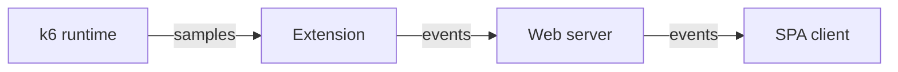
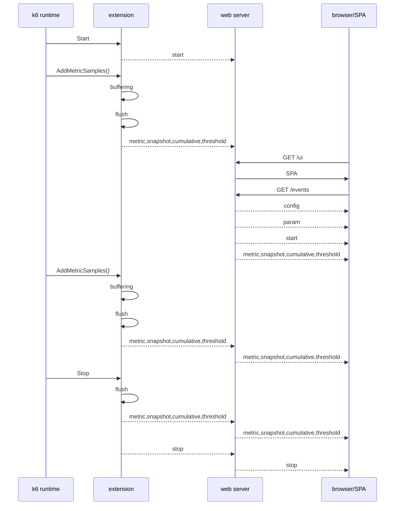

# How k6 Web dashboard works

**A deep dive into the k6 Web dashboard architecture**

This document details the functionality of the k6 Web dashboard, aiming to provide a comprehensive understanding for users. It can serve as a guide for building custom dashboard UIs and for further processing of the Web dashboard's metric sample aggregates.

## Components

The k6 Web dashboard consists of three primary components:



1. **Extension**: As a *k6 output extension*, this component continuously receives and aggregates metric samples from the k6 runtime.
2. **Web server**: As an embedded web server, this component delivers aggregated data to the browser via a *Server-Sent Events* (SSE) stream. It also hosts the embedded web dashboard Single Page Application (SPA).
3. **SPA client**: The Web dashboard UI is a *Single Page Application* (SPA) running in a browser. It is embedded within the Web dashboard extension (and, by extension, the k6 binary). The only communication channel between the SPA and the k6 process is the SSE stream. The SPA can even be hosted independently on an external static web server, separate from the k6 process.

## Data flow



Data is transferred between the k6 process and the Dashboard UI as SSE (*Server-Sent Events*) events.

The SSE events are stored in memory, ensuring that clients connecting later receive all past events. This memory requirement scales linearly (O(n)) with the number of metrics (as an aggregate is created per metric) and with time (as aggregates are created periodically).

The k6 Web dashboard continuously receives and aggregates metric samples from the k6 runtime. These samples are aggregated in two ways:

* **Cumulative:** Metrics are aggregated from the beginning of the test run to the current time.
* **Snapshot:** Metrics are aggregated for a specific interval defined by the `period` parameter.

These aggregated metrics are used to generate Server-Sent Events (SSE) for both `snapshot` and `cumulative` events. These events are optimized for size by exclusively containing metric values.

When a new metric first appears, a separate `metric` event is created from its associated data (`type`, `contains`), providing the metric's definition. To optimize size, metric aggregate data in `snapshot` and `cumulative` events is structured using parallel arrays. Each metric's aggregates are represented as an array of numbers, with the array's size determined by the `aggregates` parameter in the `param` event. These aggregate arrays populate the parallel arrays within `snapshot` and `cumulative` events. Their positions within these arrays correspond to the position of the metric definition in the array of all metric definitions, which is sorted by metric name.

Before a test begins, a `config` event (containing dashboard settings) and a `param` event (including output parameters such as `thresholds`, `scenarios`, and `period` from the k6 runtime) are generated. The `start` and `stop` events mark the beginning and end of the test, respectively.

## Events

This section details the Server-Sent Events (SSE) stream, with subheadings named after the events (indicated by the `event:` line). The events are presented in the order they appear in the stream. Each event is identified by an `id:` line, which is a sequential number starting from `0`. Events include a `data:` line, which contains additional event-specific data serialized in JSON format.

### config

The `config` event, as the initial event in the stream, carries the full dashboard UI configuration, including the definitions of tabs and graphs. This event can be disregarded if the SSE stream is intended solely for further processing of aggregates.

### param

The `param` event, which follows the `config` event, provides details about the test run, such as the script file name, update period, test run duration, and thresholds.

The `aggregates` parameter is crucial for encoding events that contain aggregate values. For size optimization, these values are not transmitted as objects. Instead, these are sent as an array where the aggregate values are arranged in lexicographical order according to their names.

For metrics of type `counter`, the `aggregates` parameter defines the following aggregate names:

```json
{"aggregates":{"counter":["count","rate"]}}
```

Aggregate values for metrics of type `counter` are encoded as a two-element array. The first element represents the counter value, and the second element represents the counter rate.

```json
[153032,76516]
```

### metric

A metric event, which precedes its first use, defines one or more metrics. It links the metric name to its type and value type. For example, before the `start` event (which includes the test's start time), a `metric` event will appear in the SSE stream to define the `time` metric.

```json
{"event":"metric","data":{"time":{"type":"gauge","contains":"time"}}}
{"event":"start","data":[[1707753110400]]}
```

The client (e.g., dashboard UI) and server (k6 extension) utilize the `metric` event to establish a comprehensive list of metrics. This metric list is crucial for events such as `snapshot` and `cumulative`, which contain aggregated metric values in their `data:` field. These aggregate values are presented as an array, ordered lexicographically by metric name, to optimize for size. For each metric, the corresponding array element holds an array of aggregate values, which vary based on the metric type.

```json
{"event":"metric","data":{"data_received":{"type":"counter","contains":"data"},"data_sent":{"type":"counter","contains":"data"},"http_req_blocked":{"type":"trend","contains":"time"},"http_req_connecting":{"type":"trend","contains":"time"},"http_req_duration":{"type":"trend","contains":"time"},"http_req_failed":{"type":"rate"},"http_req_receiving":{"type":"trend","contains":"time"},"http_req_sending":{"type":"trend","contains":"time"},"http_req_tls_handshaking":{"type":"trend","contains":"time"},"http_req_waiting":{"type":"trend","contains":"time"},"http_reqs":{"type":"counter"},"iteration_duration":{"type":"trend","contains":"time"},"iterations":{"type":"counter"},"vus":{"type":"gauge"},"vus_max":{"type":"gauge"}}}
{"event":"snapshot","data":[[153032,76516],[3112,1556],[34.708,261.19,0.00757,0.00238,157.25,242.43,260.32],[20.941,126.18,0,0,125.26,126.03,126.17],[125.46,129.5,125.23,123.41,127.7,128.34,129.25],[0],[0.12983,0.2734,0.12742,0.04063,0.20904,0.24158,0.26723],[0.05317,0.27672,0.03342,0.01047,0.07691,0.19371,0.26227],[11.077,134.78,0,0,0,111.41,133.93],[125.28,129.34,124.87,123.33,127.5,128.14,129.08],[24,12],[320.6,671.72,250.89,249.86,624.8,668.62,671.1],[12,6],[1707753112400],[2],[2]]}

```

### start

The `start` event occurs only once, preceding all `snapshot` and `cumulative` events. It includes a `gauge` type metric called `time`, which indicates the test's start time in Unix milliseconds.

```json
{"event":"start","data":[[1707753110400]]}
```

### stop

The `stop` event, the final event in the SSE stream, includes a single `gauge` type metric called `time`. This metric indicates the test's end time in Unix milliseconds.

```json
{"event":"stop","data":[[1707753130595]]}
```

### cumulative

The `cumulative` event provides an array of aggregates for each metric, calculated from the beginning of the test run. These aggregates are ordered lexicographically by metric name, with each element in the array being a numerical array that varies based on the metric type.

Recall, the `aggregates` parameter defines the number and names of the aggregates created for each metric type.

```json
{"event":"cumulative","data":[[153032,76503],[3112,1555.7],[34.708,261.19,0.00757,0.00238,157.25,242.43,260.32],[20.941,126.18,0,0,125.26,126.03,126.17],[125.46,129.5,125.23,123.41,127.7,128.34,129.25],[0],[0.12983,0.2734,0.12742,0.04063,0.20904,0.24158,0.26723],[0.05317,0.27672,0.03342,0.01047,0.07691,0.19371,0.26227],[11.077,134.78,0,0,0,111.41,133.93],[125.28,129.34,124.87,123.33,127.5,128.14,129.08],[24,11.998],[320.6,671.72,250.89,249.86,624.8,668.62,671.1],[12,5.999],[1707753112400],[2],[2]]}
```

### threshold

The `threshold` event is generated when one or more thresholds are crossed. This event associates metric names with a string array, where each item in the array specifies a threshold that was crossed.

```json
{"event":"threshold","data":{"iteration_duration":["avg < 1000"]}}
```

### snapshot

The aggregates for each metric, calculated during the aggregation period, are contained within the `snapshot` event. These aggregates are ordered lexicographically by metric name, with each element in the array being a numerical array that varies based on the metric type.

Recall, the `aggregates` parameter defines the number and names of the aggregates created for each metric type.

```json
{"event":"snapshot","data":[[153032,76516],[3112,1556],[34.708,261.19,0.00757,0.00238,157.25,242.43,260.32],[20.941,126.18,0,0,125.26,126.03,126.17],[125.46,129.5,125.23,123.41,127.7,128.34,129.25],[0],[0.12983,0.2734,0.12742,0.04063,0.20904,0.24158,0.26723],[0.05317,0.27672,0.03342,0.01047,0.07691,0.19371,0.26227],[11.077,134.78,0,0,0,111.41,133.93],[125.28,129.34,124.87,123.33,127.5,128.14,129.08],[24,12],[320.6,671.72,250.89,249.86,624.8,668.62,671.1],[12,6],[1707753112400],[2],[2]]}
```

## Web server

When the extension starts, it launches a web server. This server provides the user interface at `/ui`, the report page at `/report`, and server-sent events at `/events`.

## JSON Schema

Since the event data is JSON formatted, a JSON Schema has been created to help consumption of this data using various programming languages: [dashboard.schema.json](dashboard.schema.json)

The JSON Schema is also available in YAML format for easier readability: [dashboard.schema.yaml](dashboard.schema.yaml)
