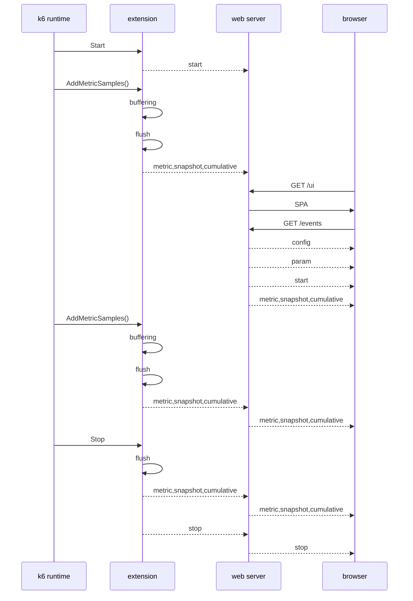

## How xk6-dashboard works

The extension as a *k6 output extension* receives the metrics from the k6 runtime. It creates two types of aggregates from the metrics.

1. `cumulative`: the metrics are aggregated from the beginning of the test run to the current time.
2. `snapshot`: the metrics are aggregated for the interval specified in the `period` parameter.

Aggregated metrics are used to create SSE events called `snapshot` and `cumulative`. These events only contain the values of the metrics. A `metric` event is created from the other data of the metrics when the metric first appears.

When the test starts and stops, a `start` and `stop` event is generated.

A `config` and a `param` event are also generated before the `start` event. The `config` event contains the dashboard configuration, while the `param` event contains the output parameters received from the k6 runtime (e.g. thresholds, scenarios, period).

The user interface is a single page web application (SPA) embedded in the extension. The HTML report page is also embedded in the extension.

When the extension starts, it starts a web server that serves the user interface (`/ui`), the report page (`/report`) and SSE events (`/events`).

The events are kept in memory by the event emitter component, so that the client that connects later also receives all events. The memory requirement increases according to O(n) with the number of metrics (an aggregate is created per metric) and with time (aggregates are created every 10 seconds by default)

### Events

The `/events` endpoint (default: http://127.0.0.1:5665/events) is a standard SSE source endpoint. Using this event source you can create your own dashboard UI.

Events will be emitted periodically based on the `period` parameter (default: `10s`). The event's `data` is a JSON object with metric names as property names and metric values as property values. The format is similar to the [List Metrics](https://k6.io/docs/misc/k6-rest-api/#list-metrics) response format from the [k6 REST API](https://k6.io/docs/misc/k6-rest-api/).

Two kind of events will be emitted:
  - `config` contains ui configuration
  - `param` contains main extension parameters (period, scenarios, thresholds, etc)
  - `start` contains start timestamp
  - `stop` contains stop timestamp
  - `metric` contains new metric definitions
  - `snapshot` contains metric values from last period
  - `cumulative` contains cumulative metric values from the test starting point

